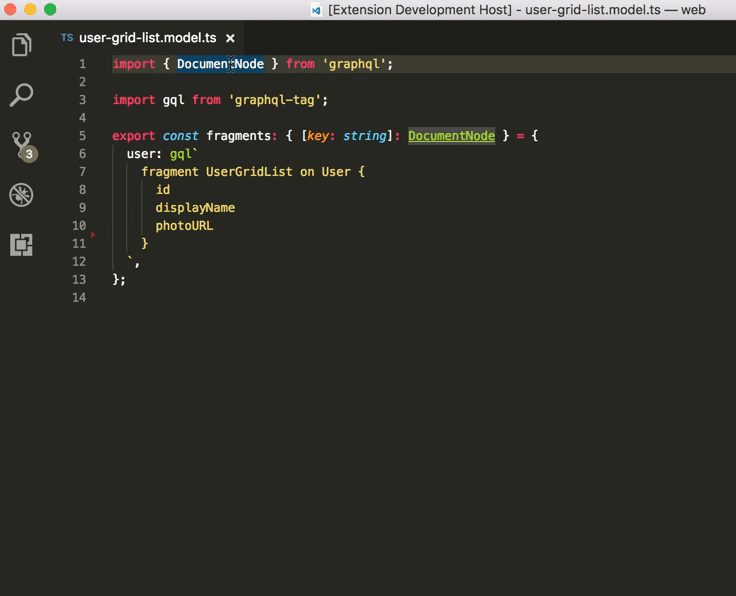

# gql2ts VS Code Extension

Generate Typescript Interface definitions automatically from gql template strings. It uses `apollo-codegen` to create the Interface definition.

## Features

Select `gql2ts: create TS Interfaces` from command palette.



## Requirements

  Install `apollo-codegen` and `get-graphql-schema` globally

  ```sh
  npm install apollo-codegen get-graphql-schema -g
  ```

  This extension requires `schema.json` to be available. Use `get-graphql-schema` to retrieve `schema.json`
  from your server.
  
  ```sh
  get-graphql-schema https://your.graphql.endpoint/graphql --json > schema.json
  ```

  By default gql2ts looks for `schema.json` in the workspace root folder. You can configure the location of `schema.json` with extension setting `gql2ts.schemaJson: 'path/to/shema.json'`.

## Extension Settings

  This extension contributes the following settings:

  * `gql2ts.schemaJson`: path to project's `schema.json`

## Known Issues

  At the time of writing, `apollo-codegen` npm is [not working as expected](https://github.com/apollographql/apollo-codegen/issues/144).

  Workaround: fork/clone apollo-codegen repo, build, then npm link the resulting node_module.

## Release Notes

See [CHANGELOG](https://github.com/bagubagu/gql2ts-vscode/blob/master/CHANGELOG.md)
